# INT3120_20 - 19021262

### Lesson 1: Giới thiệu Flutter

### Lesson 2: Cài đặt, thiết lập môi trường phát triển

### Lesson 3: Hello World
  
  
### Lesson 4: Tìm hiểu về kiến trúc ứng dụng Flutter

### Lesson 5: Tìm hiểu về Dart

### Lesson 6: Widget trong Flutter
 
 
### Lesson 7: Layout trong Flutter
  
  
### Lesson 8: Gesture trong Flutter
  
  
### Lesson 9: Quản lý trạng thái State trong Flutter

### Lesson 10: Statefulwidget trong Flutter

### Lesson 11: ScopedModel trong Flutter

### Lesson 12: Navigator và Routing
 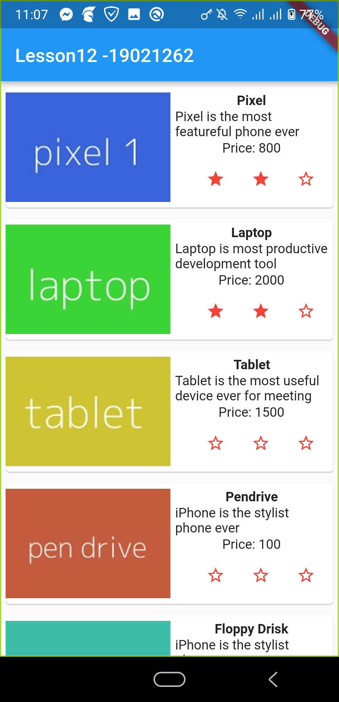
 
 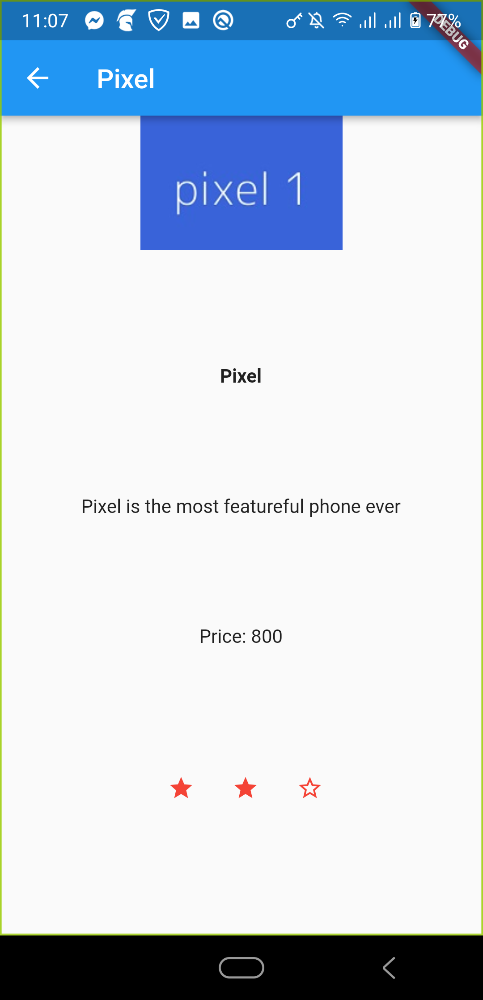
 
 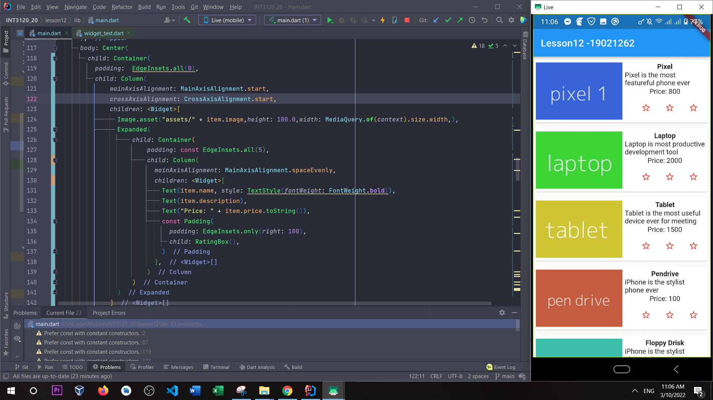
 
 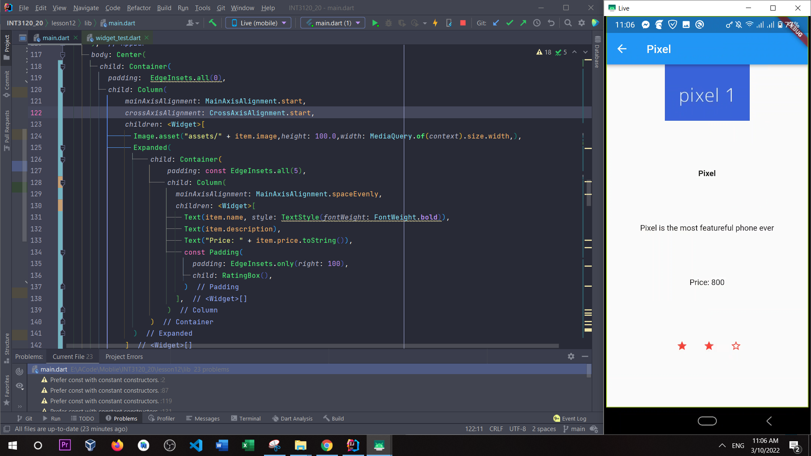
 
 
### Lesson 13: Animation
 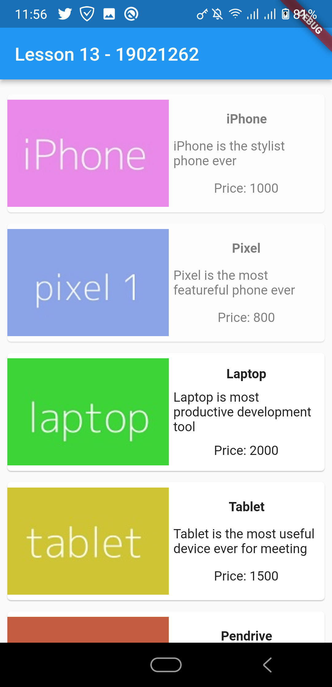
 
 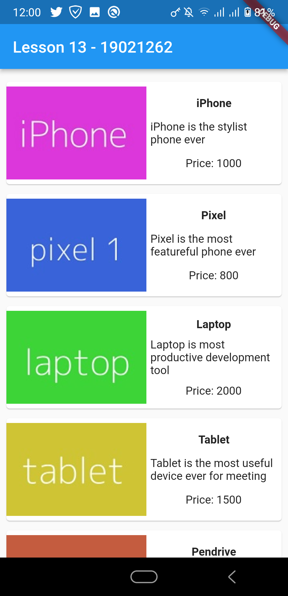
 
 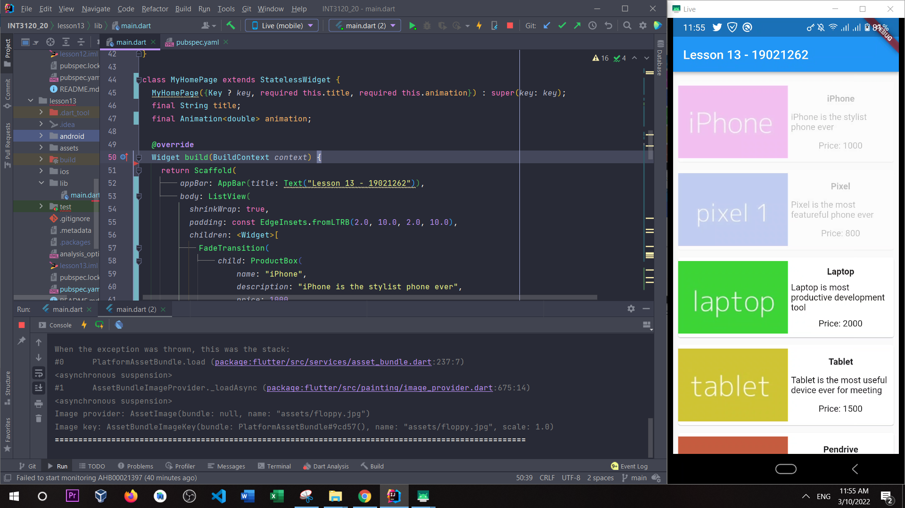
 
 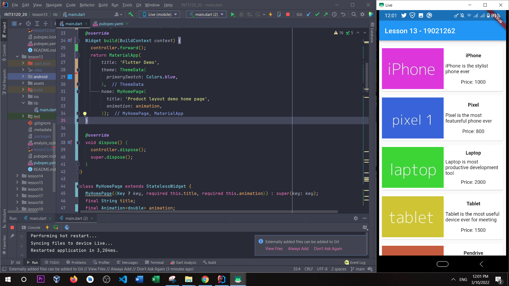
  
### Lesson 14: Code với native Android
 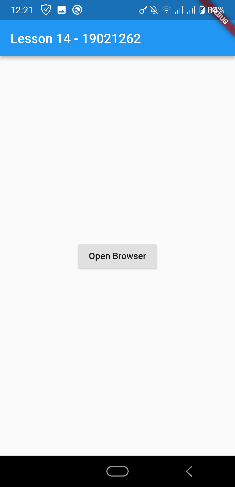
 
 
 
 
 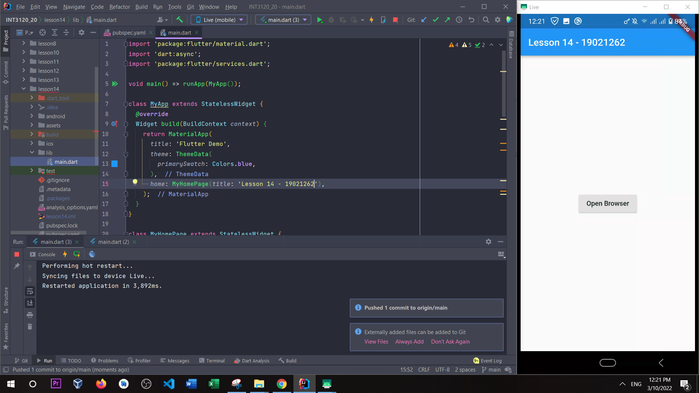
 
 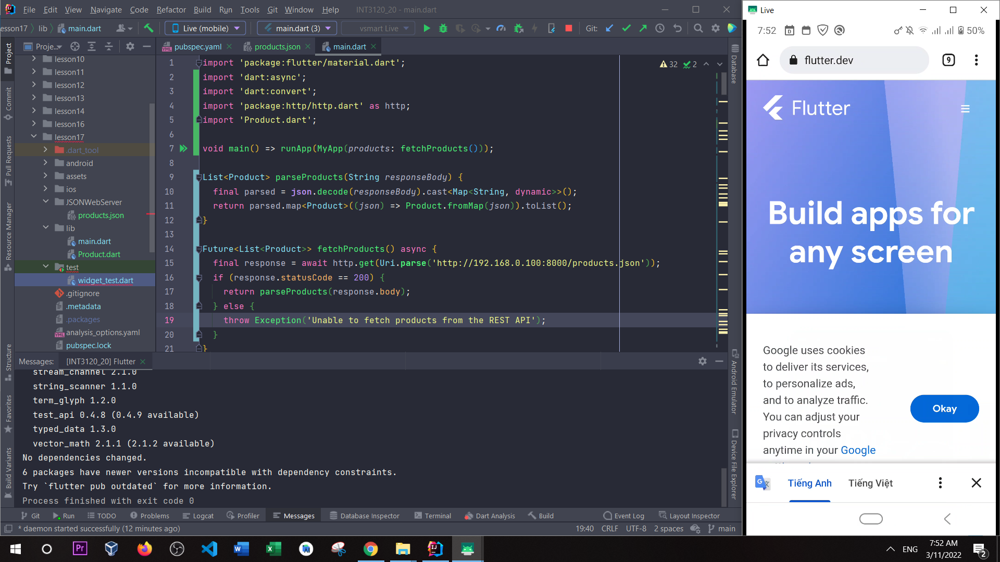
  
### Lesson 15: Code với native IOS

### Lesson 16: Giới thiệu về package
 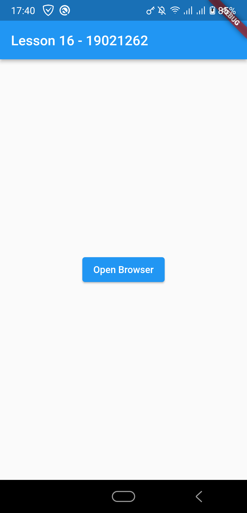
 
 
 
 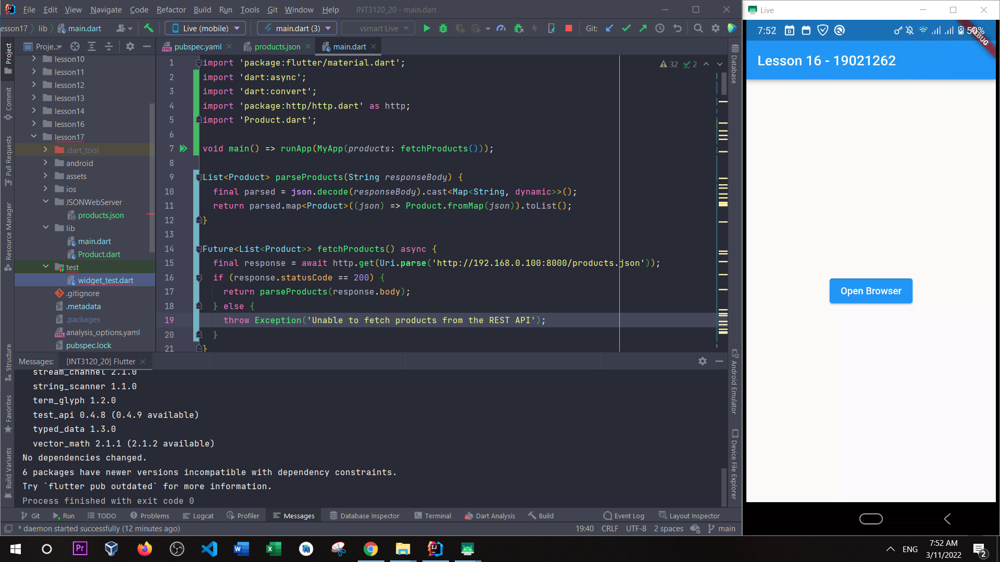
 
 

### Lesson 17: REST API
 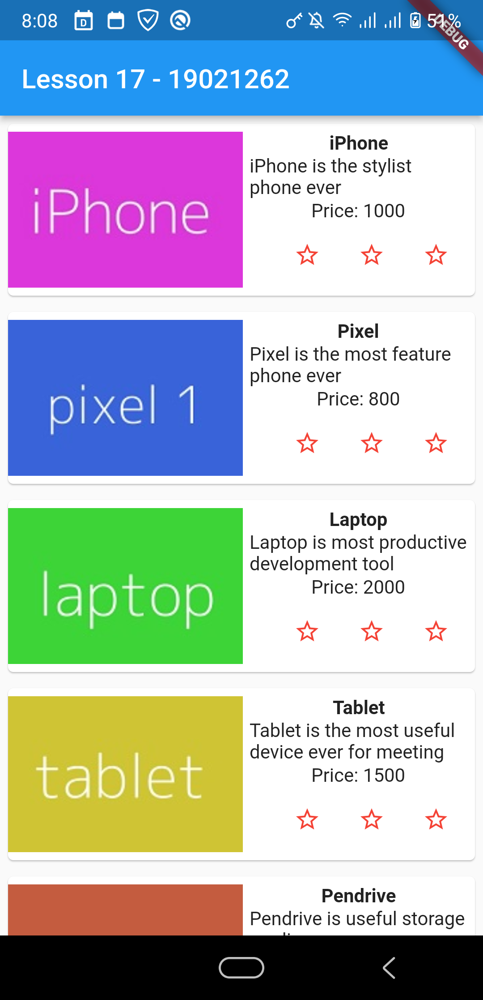
 
 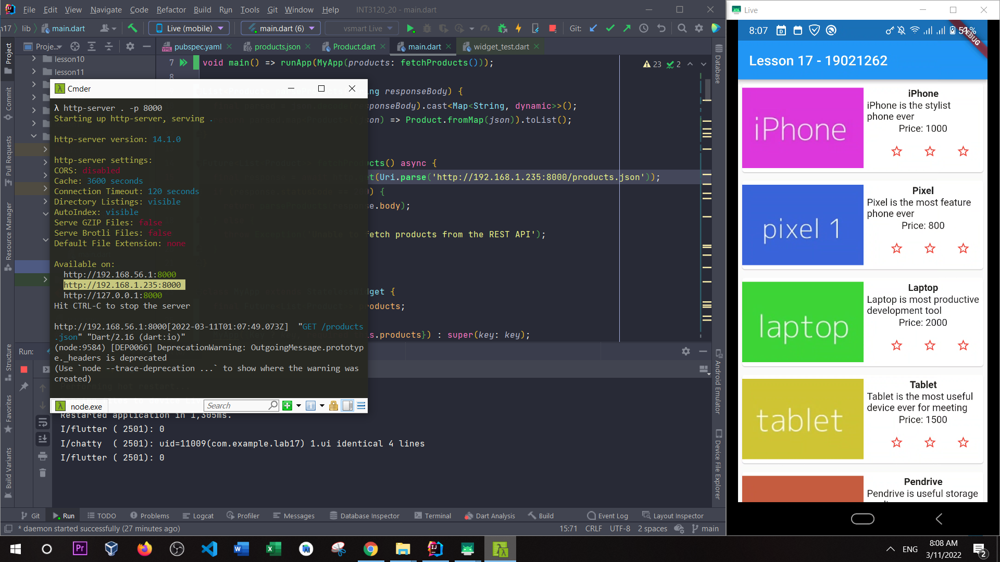

### Lesson 18: Khái niệm về Database

### Lesson 19: Chuyển đổi ngôn ngữ
 
 
 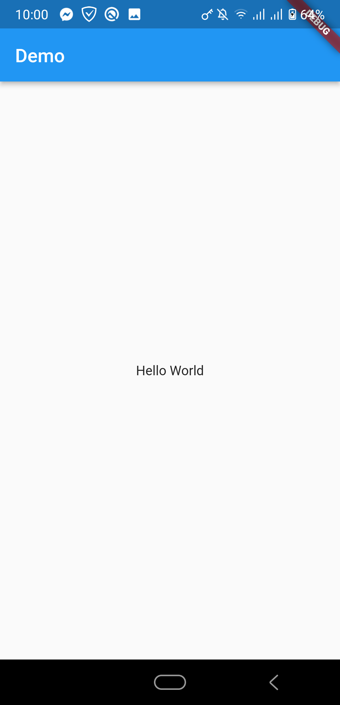
 
 
 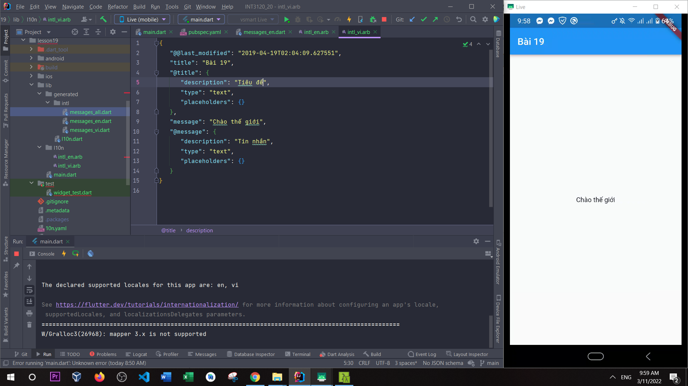
 
 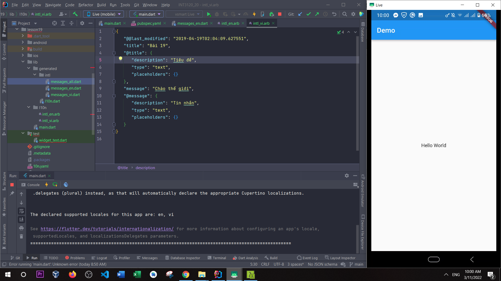
