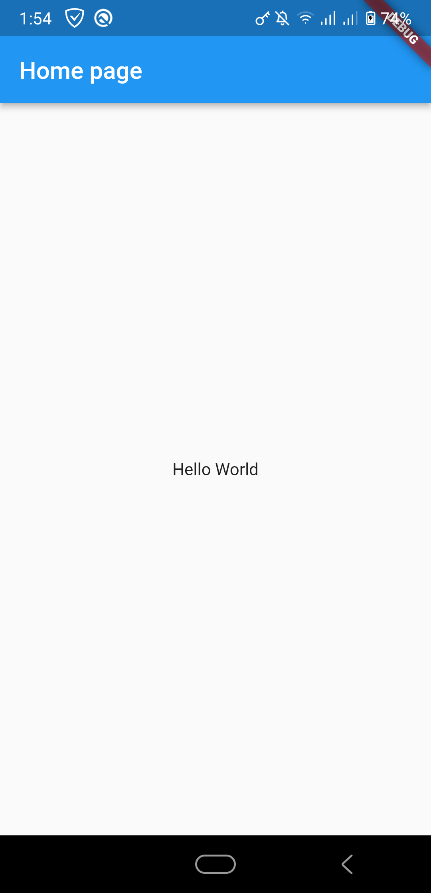
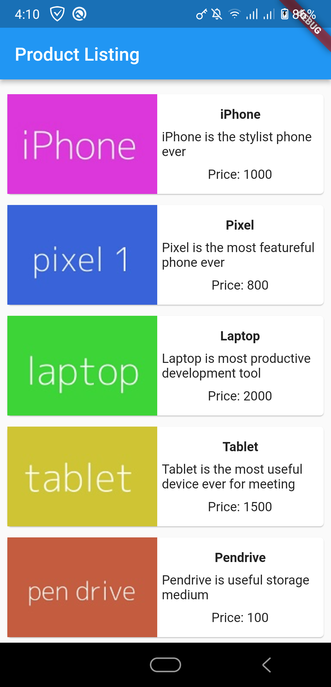
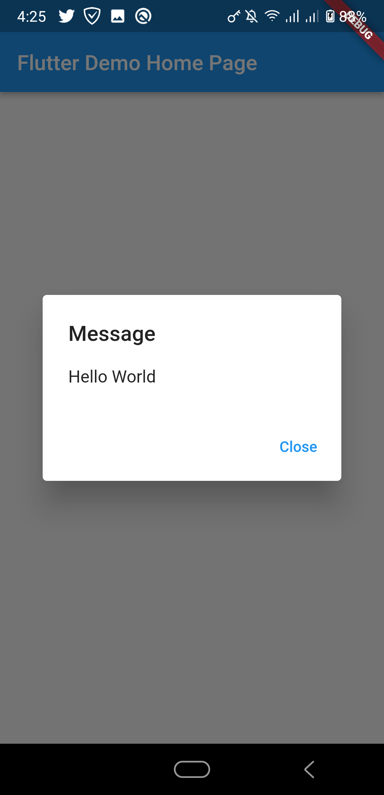
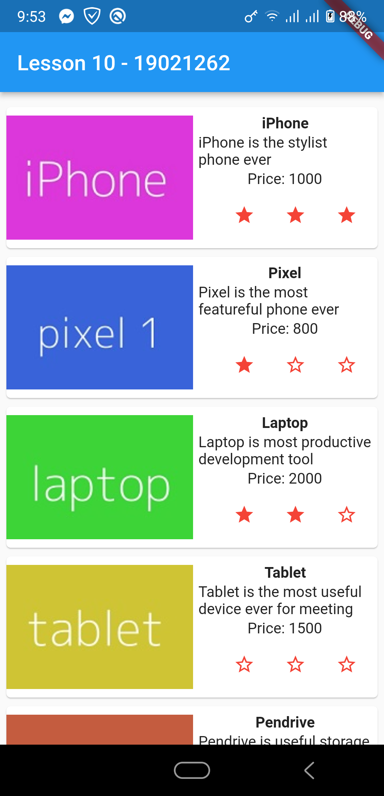

# INT3120_20

### Lesson 1: Giới thiệu Flutter
### Lesson 2: Cài đặt, thiết lập môi trường phát triển
### Lesson 3: Hello World
  
  
### Lesson 4: Tìm hiểu về kiến trúc ứng dụng Flutter

### Lesson 5: Tìm hiểu về Dart

### Lesson 6: Widget trong Flutter
 
 
### Lesson 7: Layout trong Flutter
  
  
### Lesson 8: Gesture trong Flutter
  
  
### Lesson 9: Quản lý trạng thái State trong Flutter

### Lesson 10: Statefulwidget trong Flutter

### Lesson 11: ScopedModel trong Flutter

